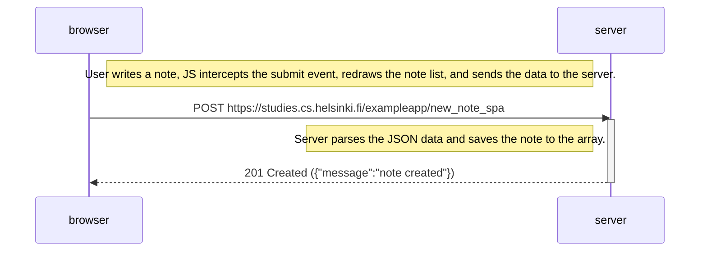

```mermaid
sequenceDiagram
    participant browser
    participant server

    Note right of browser: User writes a note, JS intercepts the submit event, redraws the note list, and sends the data to the server.
    browser->>server: POST https://studies.cs.helsinki.fi/exampleapp/new_note_spa
    activate server
    Note left of server: Server parses the JSON data and saves the note to the array.
    server-->>browser: 201 Created ({"message":"note created"})
    deactivate server
```
